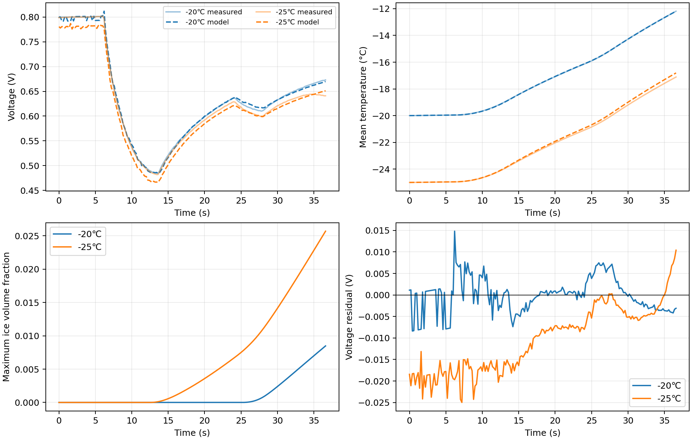

# 问题 1：一维单电池瞬态自冷启动模型的建立与验证

## 摘要

本文在题目备注 1 的一维常温模型上加入液水冻结、冰融化与冰占孔反馈，建立五层膜电极瞬态自冷启动模型。孔隙水分为蒸气、液水和冰；氢氧气体作准稳态计算，膜含水量用平均状态表示。保持附件 1 的已知参数不变，用 −20 ℃ 实验校准四个未指定的等效参数，以 −25 ℃ 实验独立检验。两工况电压均方根误差分别为 0.00401 V、0.01295 V，平均温度均方根误差分别为 0.00968 ℃、0.14124 ℃；36.6 s 时最大冰体积分数分别为 0.00848、0.02570。冰量没有实验直接观测，其绝对值仍是模型推断。

**关键词：**质子交换膜燃料电池；一维冷启动；三相水；冰占孔；有限体积法

## 1 问题重述与建模思路

问题 1 要求从备注 1 的常温一维参考模型出发，加入低温水—冰相变和冰堵效应，计算单电池平均温度、最大冰体积分数和电压，并用附件 2 的 −20 ℃ 与 −25 ℃ 实验填表验证 [1]。模型的作用链为：外加电流产生热与水；温度影响水的气液分配及冻结；冰和液水缩小气体可通孔隙；阴极冰减小有效反应面积；电压变化又反馈到产热。

本文采用现有程序已实现的一维等效路线。文献 [2]、[3] 仅用于说明冷启动水热耦合的物理背景；[3] 的三维多相方程和材料参数不是必选结构，也不替换附件 1 的数值。文中方程、参数和验证结果均对应同一套程序。

## 2 计算域、变量与假设

厚度坐标 $x$ 从阳极指向阴极。五层依次为 aGDL、aCL、PEM、cCL、cGDL，总厚度 $L=326.7\,\mu\mathrm m$。

| 层 | 厚度/μm | 初始孔隙率 $\varepsilon_0$ | 基础导热率/(W m⁻¹ K⁻¹) | 基础体积热容/(J m⁻³ K⁻¹) |
| --- | ---: | ---: | ---: | ---: |
| aGDL | 150 | 0.8000 | 0.30 | $185\times545$ |
| aCL | 3.4 | 0.3916 | 0.27 | $970\times240$ |
| PEM | 12 | — | 0.24 | $2150\times1050$ |
| cCL | 11.3 | 0.4207 | 0.27 | $970\times240$ |
| cGDL | 150 | 0.8000 | 0.30 | $185\times545$ |

各层在面内均匀，仅考虑厚度方向的传质与传热；气体为理想气体，氢氧扩散相对于 0.2 s 的采样间隔视为准稳态；催化层的反应源项沿层厚均布。蒸气与液水在多孔单元内瞬时分相。膜水用一个平均含水量表示，双极板仅提供热容、不另建温度网格。初始孔隙液水与冰为零。

记 $w(x,t)$ 为单位多孔控制体总体积内的总孔隙水质量，$i(x,t)$ 为其中的冰质量，$m_v,m_l$ 分别为蒸气、液水质量，则

$$
w=m_v+m_l+i,\quad
\varepsilon_i=\frac{i}{\rho_i},\quad
s_i=\frac{\varepsilon_i}{\varepsilon_0},\quad
\varepsilon_g=\varepsilon_0-\varepsilon_i-\frac{m_l}{\rho_l}. \tag{1}
$$

冰和液水密度分别取附件 1 的 $\rho_i=920$、$\rho_l=990\,\mathrm{kg\,m^{-3}}$。题目要求的冰体积分数是 $\varepsilon_i$，不是孔隙冰饱和度 $s_i$。物理上需满足 $0\le i\le w$、$m_l\ge0$ 和 $\varepsilon_g\ge0$。

## 3 三相水、膜吸水与相变方程

### 3.1 水量守恒

对厚度 $\Delta x$、单位截面积的多孔控制体，水蓄积等于两侧净通量、反应产水和膜吸水之和。令 $N_v,N_l$ 为沿正 $x$ 方向的蒸气、液水质量通量，则

$$
\frac{\partial w}{\partial t}
=-\frac{\partial(N_v+N_l)}{\partial x}
+\mathbf1_{\rm cCL}\frac{jM_w}{2FL_{\rm cCL}}
-\mathbf1_{\rm cCL}\frac{u}{L_{\rm cCL}}. \tag{2}
$$

其中 $j(t)$ 取附件 2 的逐时电流密度，计算时由 A cm⁻² 换算为 A m⁻²；$M_w=0.018\,\mathrm{kg\,mol^{-1}}$，$F=96485\,\mathrm{C\,mol^{-1}}$。$u(t)$ 为单位面积进入膜的等效水质量速率。PEM 不允许孔隙蒸气或液水直接穿透，两侧外表面允许蒸气随干气排出。

### 3.2 蒸气、液水分相与迁移

按备注 1 式（28）的 Buck 饱和蒸气压分段关系，零度以下采用冰面分支。每个多孔单元先扣除冰，再作局部气液分相：

$$
m_{\rm sat}=(\varepsilon_0-\varepsilon_i)
\frac{M_wp_{\rm sat}(T)}{RT},\qquad
m_v=\min\{(w-i)_+,m_{\rm sat}\},\qquad
m_l=(w-i-m_v)_+. \tag{3}
$$

$R=8.314\,\mathrm{J\,mol^{-1}K^{-1}}$。式（3）以扣除冰后的初始孔隙近似蒸气饱和容量；实际气体扩散再按式（1）扣除液水。这是现有程序的分相顺序。蒸发和冷凝由瞬时分相隐含处理，不额外设置速率。传输通量为

$$
N_v=-D_{v,\rm eff}\frac{\partial(m_v/\varepsilon_g)}{\partial x},\quad
D_{v,\rm eff}=D_{v,\rm ref}
\left(\frac{T}{298.15}\right)^{1.75}\varepsilon_g^{1.5},\quad
N_l=-D_{l,\rm eq}\frac{\partial m_l}{\partial x}. \tag{4}
$$

备注 1 给出阳极/阴极蒸气参考扩散系数 $8.69\times10^{-5}/2.48\times10^{-5}\,\mathrm{m^2s^{-1}}$。旧程序的 GDL/CL 液水等效扩散系数分别为 $2\times10^{-9}/2\times10^{-10}\,\mathrm{m^2s^{-1}}$，用于近似毛细迁移，是模型假设，并非附件 1 或文献 [3] 的定值。本模型不显式计算毛细压。

### 3.3 膜平均含水量

膜初始含水量 $\lambda_0=3$，其余程序常量为 $\rho_{\rm pem}=2150\,\mathrm{kg\,m^{-3}}$、$EW=1\,\mathrm{kg\,mol^{-1}}$、$L_{\rm pem}=12\,\mu\mathrm m$。令 $C_\lambda^A=\rho_{\rm pem}M_wL_{\rm pem}/EW$ 为膜含水量每增加 1 所需的单位面积水质量。程序采用等效上限 $\lambda_{\max}=14$：

$$
u=\min\left\{
\frac{jM_w}{2F}\beta
\frac{(\lambda_{\max}-\lambda)_+}{\lambda_{\max}-\lambda_0},
\frac{(\lambda_{\max}-\lambda)_+C_\lambda^A}{\Delta t}
\right\},\qquad
\frac{d\lambda}{dt}\simeq\frac{u}{C_\lambda^A}. \tag{5}
$$

$\beta$ 是待校准的膜吸水分配系数；第二项防止单步吸水超过剩余容量。该平均状态用于膜电导及阴极水合活性，不代表膜内水空间迁移或膜内结冰已经求解。

### 3.4 液水冻结、冰融化

冰在原位生成与融化，不作空间迁移：

$$
\frac{\partial i}{\partial t}=r_f-r_m,\quad
r_f=k_f\operatorname{clip}\left(\frac{273.15-T}{20},0,3\right)m_l,\quad
r_m=k_m\operatorname{clip}\left(\frac{T-273.15}{5},0,3\right)i. \tag{6}
$$

温差分母的单位为 K。旧程序取 $k_f=k_m=0.2\,\mathrm{s^{-1}}$；附件 1 未给独立有量纲液水—冰速率，故它们是等效假设，不是 [3] 的参数。冻结受液水供应限制；剩余孔容在数值更新时施加上限，融化仅在高于冰点时生效。每步采用 $1-\exp[-k\,g(T)\Delta t]$ 更新，并限制冻结质量不超过可用液水和孔容。

## 4 气体扩散、活性面积与电压

氢气与氧气在多孔层的准稳态守恒为

$$
0=\frac{\partial}{\partial x}\left(
D_{k,\rm eff}\frac{\partial c_k}{\partial x}\right)+S_k,\quad
S_{\rm H_2}=-\mathbf1_{\rm aCL}\frac{j}{2FL_{\rm aCL}},\quad
S_{\rm O_2}=-\mathbf1_{\rm cCL}\frac{j}{4FL_{\rm cCL}},\quad
D_{k,\rm eff}=D_{k,\rm ref}
\left(\frac{T}{298.15}\right)^{1.75}\varepsilon_g^{1.5}. \tag{7}
$$

$D_{\rm H_2,ref}=1.10\times10^{-4}$、$D_{\rm O_2,ref}=2.20\times10^{-5}\,\mathrm{m^2s^{-1}}$。压力固定为附件 1 的 101325 Pa，故备注 1 式（16）的压力比等于 1。阳极外表面输入纯氢，阴极外表面输入干空气；氧/氮质量分数 0.233/0.767 换算为氧摩尔分数约 0.210。冰和液水通过式（1）缩小 $\varepsilon_g$，从而抑制气体传输。

附件 1 规定阴极冰覆盖指数 3.5。旧程序另外用平均膜水合量修正活性面积：

$$
f_i=\left\langle(1-s_i)^{3.5}\right\rangle_{\rm cCL},\qquad
f_\lambda=\left(\frac{\lambda}{\lambda_0}\right)^\gamma,\qquad
f_{\rm act}=f_if_\lambda. \tag{8}
$$

尖括号为 cCL 网格算术平均，$\gamma$ 是待校准的水合活性指数，与固定的冰覆盖指数不同。电压沿用备注 1 的可逆电压与三类损失结构：

$$
V=E_{\rm rev}-\eta_{\rm act}-\eta_{\rm ohm}-\eta_{\rm con},\quad
E_{\rm rev}=1.229-8.5\times10^{-4}(\bar T-298.15)
+\frac{R\bar T}{2F}
\ln\left(\frac{p_{\rm H_2}}{p_0}
\sqrt{\frac{p_{\rm O_2}}{p_0}}\right). \tag{9}
$$

$\bar T$ 是五层 MEA 的厚度加权平均绝对温度，分压由催化层平均气体浓度求得，$p_0=101325\,\mathrm{Pa}$。各项闭合为

$$
\begin{aligned}
j_0(\bar T)&=j_{0,\rm ref}\exp\left[
-\frac{67000}{R}\left(\frac1{\bar T}-\frac1{298.15}\right)\right],\\
\eta_{\rm act}&=\frac{R\bar T}{0.5F}
\operatorname{arsinh}\left(\frac{j}{2j_0(\bar T)f_{\rm act}}\right),\\
\kappa(\bar T,\lambda)&=(0.5139\lambda-0.326)
\exp\left[1268\left(\frac1{303.15}-\frac1{\bar T}\right)\right],\\
\eta_{\rm ohm}&=j\left[
\frac{L_{\rm pem}}{\kappa(\bar T,\lambda)}
+R_c+R_d\left(\frac{\lambda_0}{\lambda}\right)^2\right],\\
\eta_{\rm con}&=-\frac{R\bar T}{4F}
\ln\left(1-\frac{j}{j_{\rm lim}}\right).
\end{aligned}\tag{10}
$$

$R_c=0.01\,\Omega\,\mathrm{cm^2}=10^{-6}\,\Omega\,\mathrm{m^2}$ 固定；$R_d$ 为水合相关附加界面面积比电阻，另行校准，不替代 $R_c$。备注 1 的 $j_{0,\rm ref}=0.01\,\mathrm{A\,m^{-2}}$ 是初始校准值。极限电流用 cGDL 全层与 cCL 半层的等效扩散阻力近似：

$$
\mathcal R_D=\int_{\rm cGDL}\frac{dx}{D_{\rm O_2,eff}}
+\frac12\int_{\rm cCL}\frac{dx}{D_{\rm O_2,eff}},
\qquad j_{\rm lim}=\frac{4F\bar c_{\rm O_2,cCL}}{\mathcal R_D}. \tag{11}
$$

其中 $\bar c_{\rm O_2,cCL}$ 为 cCL 平均氧浓度。程序对极小浓度、电导和对数自变量设数值下限，并检查真实状态的最小气体浓度与最大孔隙占用。

## 5 能量方程、边界与输出定义

温度场满足

$$
C_{\rm eff}\frac{\partial T}{\partial t}
=\frac{\partial}{\partial x}
\left(k_{\rm eff}\frac{\partial T}{\partial x}\right)
+\frac{j(E_{\rm th}-V)}{L}
+h_f\frac{\partial i}{\partial t},\quad
E_{\rm th}=1.48\,\mathrm V,\quad
h_f=333600\,\mathrm{J\,kg^{-1}}. \tag{12}
$$

电化学热沿 MEA 均布；结冰释放潜热，融化吸热。基础体积热容为表中 $C_0$。双侧双极板的单位面积热容为 $2(0.002)(1980)(766)=6066.72\,\mathrm{J\,m^{-2}K^{-1}}$，程序按 $C_{\rm eff}=C_0+6066.72/L$ 均摊到 MEA。局部导热率使用一阶混合近似

$$
k_{\rm eff}=k_0+\varepsilon_i(2.3-0.024)
+\frac{m_l}{\rho_l}(0.6-0.024)
\quad\mathrm{W\,m^{-1}K^{-1}}. \tag{13}
$$

层间热流按两侧半单元热阻串联。两侧外边界用 $h=40\,\mathrm{W\,m^{-2}K^{-1}}$ 对流。初温取各实验首时温度，环境温度分别为 −20 ℃、−25 ℃，不改材料参数。三个题目输出为

$$
\bar T_C(t)=\frac1L\int_0^LT(x,t)\,dx-273.15,\quad
\varepsilon_{i,\max}(t)
=\max_{x\in\Omega_{\rm porous}}\frac{i(x,t)}{\rho_i},
\quad V(t)\text{ 由式（9）—（11）计算}. \tag{14}
$$

双极板热容已计入动态，但 $\bar T_C$ 仍只在五层 MEA 上求空间平均。

## 6 参数校准与数据口径

附件 1 指定的层厚、孔隙率、热物性、膜初值、冰覆盖指数及换热系数固定。未指定的等效闭合按旧程序假设或用 −20 ℃ 校准。逐项记录见[参数使用与来源](../result/参数使用与来源.csv)，附件原表见[附件1参数原表](../result/附件1参数原表.csv)。

| 参数 | 使用值 | 来源及处理 |
| --- | ---: | --- |
| $j_{0,\rm ref}$ | $0.2584506\,\mathrm{A\,m^{-2}}$ | 从备注 1 初值出发，仅用 −20 ℃ 识别 |
| 膜吸水分配 $\beta$ | 0.7706034 | 未指定的等效闭合，仅用 −20 ℃ 识别 |
| 水合活性指数 $\gamma$ | 1.5743562 | 未指定的等效闭合，仅用 −20 ℃ 识别 |
| 附加界面阻抗 $R_d$ | $1.6591137\times10^{-4}\,\Omega\,\mathrm{m^2}$ | 未指定的等效闭合，仅用 −20 ℃ 识别 |
| 冻结/融化速率 | $0.2/0.2\,\mathrm{s^{-1}}$ | 旧程序假设；冻结速率做敏感性分析 |
| GDL/CL 液水等效扩散系数 | $2\times10^{-9}/2\times10^{-10}\,\mathrm{m^2s^{-1}}$ | 旧程序假设；做迁移敏感性分析 |

每组实验含 184 点，时间 0—36.6 s。附件 2 的电流除以电流密度，反推面积约 303—310 cm²，与附件 1 的 25 cm² 不符。单位面积方程直接采用实验电流密度列，不修改附件 1 的面积，也不据电流列重算 $j$。

−20 ℃ 的电压及平均温度同时进入校准。令 $r_{V,n}=(V_n^{\rm sim}-V_n^{\rm exp})/0.020$、$r_{T,n}=(\bar T_{C,n}^{\rm sim}-T_n^{\rm exp})/0.30$，求解带边界的 soft-L1 目标：

$$
\min_\theta\sum_n
\left[\rho(r_{V,n}^2)+\rho(r_{T,n}^2)\right],
\quad \rho(z)=2(\sqrt{1+z}-1),\quad
\theta=(j_{0,\rm ref},\beta,\gamma,R_d). \tag{15}
$$

−25 ℃ 数据不参与拟合，只用于检验同一组参数的外推。四个拟合值也会吸收未显式求解的膜水迁移、局部反应及界面过程影响，不能理解为独立测得的材料常数。

## 7 数值离散与可信度检查

五层基础网格为 $8/3/4/5/8$ 个控制体，最终各层三倍细分为 84 格。输入电流密度在观测点之间线性插值，内部最大步长 0.05 s。每步先计算产水及膜吸水，再隐式求解孔隙可迁移水、局部更新冰、隐式求解温度，最后计算电压。湿/干活动集由式（3）迭代确定，单元面水热通量采用两侧半单元阻力串联。水量和能量按单位面积分别核查：

$$
M_{\rm gen}=M_{\rm pore}+M_{\rm membrane}+M_{\rm escape},
\qquad
Q_{\rm elec}+Q_{\rm latent}=Q_{\rm ambient}+\Delta U. \tag{16}
$$

−20 ℃、−25 ℃ 最大水量闭合误差分别为 $1.30\times10^{-17}$、$3.90\times10^{-18}\,\mathrm{kg\,m^{-2}}$；最大能量闭合误差分别为 $8.27\times10^{-6}$、$8.34\times10^{-6}\,\mathrm{J\,m^{-2}}$。最大总孔隙占用分别为 0.03667、0.08464；最小气体浓度分别为 9.706、9.876 mol m⁻³。−20 ℃ 下把 84 格增至 112 格，电压与温度最大差分别为 $9.65\times10^{-5}$ V、$1.81\times10^{-4}$ ℃；最大步长从 0.05 s 减为 0.025 s，分别为 $2.99\times10^{-5}$ V、0.00212 ℃。这些说明当前窗口内的数值解较稳定，并不证明冰参数唯一可辨。

## 8 验证结果与敏感性

题目定义 $X\in\{V,\bar T_C\}$ 的逐点相对误差为

$$
\epsilon_X(t)=100\%
\frac{|X_{\rm sim}(t)-X_{\rm exp}(t)|}
{|X_{\rm exp}(t)|}. \tag{17}
$$

温度按题目要求以实验摄氏度为分母；接近 0 ℃ 时百分数对零点敏感，故同时报告 MAE 与 RMSE。下列两表直接给出题目指定的 0、5、…、35 s 验证结果；全时序的详细分析也见[问题 1 数据结果分析](问题1数据结果分析文档.md)。

**表 1　−20 ℃ 工况：模型预测与实验验证（参数校准）**

| 时间/s | 实验电压/V | 模型电压/V | 电压误差/% | 实验温度/℃ | 模型温度/℃ | 温度误差/% | 最大冰体积分数 |
| ---: | ---: | ---: | ---: | ---: | ---: | ---: | ---: |
| 0 | 0.799 | 0.800 | 0.14 | −20.00 | −20.00 | 0.00 | 0.00000 |
| 5 | 0.801 | 0.793 | 0.99 | −19.96 | −19.96 | 0.00 | 0.00000 |
| 10 | 0.538 | 0.542 | 0.74 | −19.65 | −19.67 | 0.07 | 0.00000 |
| 15 | 0.521 | 0.516 | 0.90 | −18.41 | −18.41 | 0.03 | 0.00000 |
| 20 | 0.599 | 0.600 | 0.16 | −17.08 | −17.07 | 0.07 | 0.00000 |
| 25 | 0.626 | 0.630 | 0.61 | −15.90 | −15.89 | 0.10 | 0.00000 |
| 30 | 0.633 | 0.633 | 0.05 | −14.27 | −14.28 | 0.04 | 0.00239 |
| 35 | 0.666 | 0.662 | 0.55 | −12.67 | −12.67 | 0.03 | 0.00701 |

**表 2　−25 ℃ 工况：模型预测与实验验证（独立验证）**

| 时间/s | 实验电压/V | 模型电压/V | 电压误差/% | 实验温度/℃ | 模型温度/℃ | 温度误差/% | 最大冰体积分数 |
| ---: | ---: | ---: | ---: | ---: | ---: | ---: | ---: |
| 0 | 0.799 | 0.781 | 2.31 | −25.00 | −25.00 | 0.00 | 0.00000 |
| 5 | 0.800 | 0.782 | 2.22 | −24.96 | −24.96 | 0.01 | 0.00000 |
| 10 | 0.537 | 0.519 | 3.30 | −24.65 | −24.64 | 0.04 | 0.00000 |
| 15 | 0.518 | 0.502 | 3.17 | −23.38 | −23.32 | 0.26 | 0.00057 |
| 20 | 0.592 | 0.585 | 1.21 | −22.03 | −21.92 | 0.50 | 0.00359 |
| 25 | 0.618 | 0.613 | 0.87 | −20.85 | −20.69 | 0.75 | 0.00750 |
| 30 | 0.621 | 0.616 | 0.83 | −19.20 | −19.00 | 1.07 | 0.01413 |
| 35 | 0.644 | 0.644 | 0.00 | −17.59 | −17.31 | 1.58 | 0.02283 |

184 点全时序指标如下。

| 工况 | 电压 MAE/V | 电压 RMSE/V | 电压平均相对误差/% | 温度 MAE/℃ | 温度 RMSE/℃ | 温度平均相对误差/% | 36.6 s 最大冰体积分数 |
| --- | ---: | ---: | ---: | ---: | ---: | ---: | ---: |
| −20 ℃（校准） | 0.00304 | 0.00401 | 0.478 | 0.00777 | 0.00968 | 0.046 | 0.00848 |
| −25 ℃（独立验证） | 0.01099 | 0.01295 | 1.765 | 0.10560 | 0.14124 | 0.536 | 0.02570 |

图 1　两组工况的逐时预测。−25 ℃ 电压误差比校准工况更大，前 15 s 多偏低约 0.02 V；温度在后段略偏高，35 s 约高 0.28 ℃。较冷工况更早出现模型结冰，末时冰体积分数更高。两组对应最大孔隙冰饱和度分别为 0.02016 和 0.06108。

冰量没有实验直接观测。把 −20 ℃ 冻结速率乘 0.2 或 5，模型的最大冰体积分数由 0.00184 变化至 0.03030，电压 RMSE 却仅在 0.00390—0.00473 V 之间变化。液水等效扩散系数同样影响冰积累。因此电压拟合良好不能证明冰动力学参数正确，冰的绝对值只能作为模型预测。

## 9 结论与适用范围

一维等效模型连接了产水、气液分相、液水冻结、冰占孔、阴极反应面积、电压和温度。在附件 1 已知参数固定的条件下，−20 ℃ 校准后对 −25 ℃ 的短时电压与温升仍有预测能力，但误差增大。[3] 仅作为参考文献，不作为必须采用的复杂模型。

两组实验终点均低于 0 ℃，因此不能报告融冰过程、成功启动时刻或最低可启动温度。膜平均水状态、等效液水扩散与均摊双极板热容限制了更长时段的使用。直接检验冰及膜水机制仍需局部冰量、膜阻抗或出口水量等独立测量。可复算材料位于问题1目录的模型与运行程序以及 result 目录。

## 参考文献

[1] 2026 年中国研究生数学建模竞赛 B 题：《氢燃料电池低温冷启动建模与控制策略研究》，问题 1、备注 1—2、附件 1—2。

[2] Luo Y, Jiao K. Cold start of proton exchange membrane fuel cell[J]. *Progress in Energy and Combustion Science*, 2018, 64: 29–61. DOI: 10.1016/j.pecs.2017.10.003.

[3] Jiao K, Li X. Three-dimensional multiphase modeling of cold start processes in polymer electrolyte membrane fuel cells[J]. *Electrochimica Acta*, 2009, 54(27): 6876–6891. DOI: 10.1016/j.electacta.2009.06.072.
