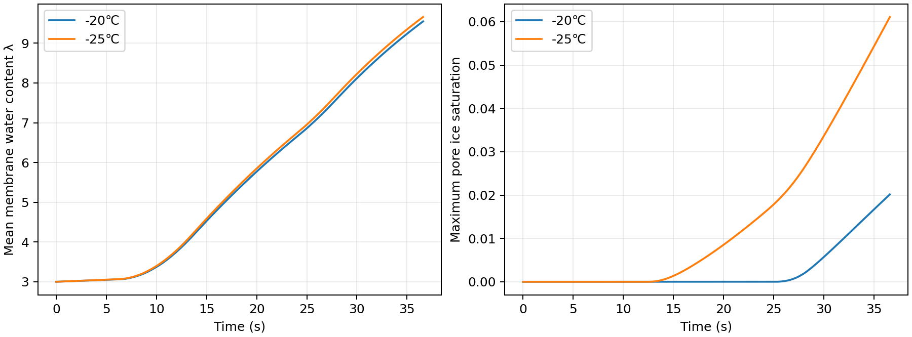
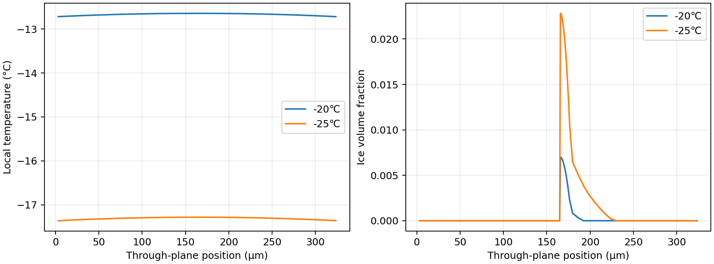
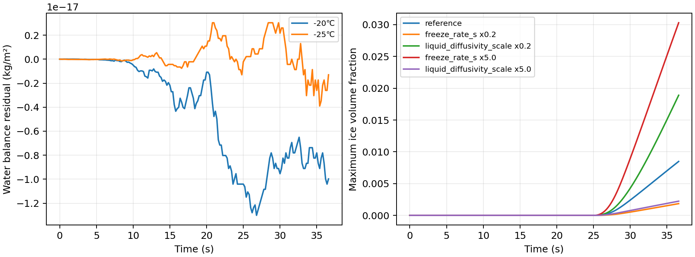

# 问题 1 数据结果分析

−20℃ 参数校准与 −25℃ 独立验证  |  附件 1 固定参数

采用附件 1 固定参数并仅在 −20℃ 上识别未规定的等效闭合后，−20℃ 的电压/温度 RMSE 分别为 0.0040 V 和 0.0097℃；未参与校准的 −25℃ 工况分别为 0.0129 V 和 0.1412℃。两组均为短时、未跨越 0℃ 的自冷启动过程，冰量只有模型预测，缺少实验直接校验。

## 1 数据口径与相对误差

附件 2 的两张工作表各含 184 个采样点，时间为 0–36.6 s，字段为时间、电流、电压、温度、电流密度。−20℃ 用于校准；−25℃ 完全留出。模型驱动取附件 2 的电流密度列。附件 1 固定活化面积 25 cm²，但附件 2 电流/电流密度之比约为 300 cm²，故两列不能同时视为同一 25 cm² 电池的量；未擅自改动面积或重算电流密度。

$$
\varepsilon_X(t)=100\%\,\frac{|X_{\mathrm{sim}}(t)-X_{\mathrm{exp}}(t)|}{|X_{\mathrm{exp}}(t)|}
$$

按题目式（1）分别对电压 V 和以摄氏度记录的温度 T 计算相对误差。温度相对误差是题目指定的表格指标，量纲与零点选择敏感；跨工况比较同时给出更稳定的 MAE 与 RMSE。

## 2 题目表 1 与表 2

### −20℃（校准）

| 时间/s | 实验电压/V | 模型电压/V | 电压误差/% | 实验温度/℃ | 模型温度/℃ | 温度误差/% | 最大冰体积分数 |
| --- | --- | --- | --- | --- | --- | --- | --- |
| 0 | 0.799 | 0.800 | 0.14 | -20.00 | -20.00 | 0.00 | 0.00000 |
| 5 | 0.801 | 0.793 | 0.99 | -19.96 | -19.96 | 0.00 | 0.00000 |
| 10 | 0.538 | 0.542 | 0.74 | -19.65 | -19.67 | 0.07 | 0.00000 |
| 15 | 0.521 | 0.516 | 0.90 | -18.41 | -18.41 | 0.03 | 0.00000 |
| 20 | 0.599 | 0.600 | 0.16 | -17.08 | -17.07 | 0.07 | 0.00000 |
| 25 | 0.626 | 0.630 | 0.61 | -15.90 | -15.89 | 0.10 | 0.00000 |
| 30 | 0.633 | 0.633 | 0.05 | -14.27 | -14.28 | 0.04 | 0.00239 |
| 35 | 0.666 | 0.662 | 0.55 | -12.67 | -12.67 | 0.03 | 0.00701 |

### −25℃（验证）

| 时间/s | 实验电压/V | 模型电压/V | 电压误差/% | 实验温度/℃ | 模型温度/℃ | 温度误差/% | 最大冰体积分数 |
| --- | --- | --- | --- | --- | --- | --- | --- |
| 0 | 0.799 | 0.781 | 2.31 | -25.00 | -25.00 | 0.00 | 0.00000 |
| 5 | 0.800 | 0.782 | 2.22 | -24.96 | -24.96 | 0.01 | 0.00000 |
| 10 | 0.537 | 0.519 | 3.30 | -24.65 | -24.64 | 0.04 | 0.00000 |
| 15 | 0.518 | 0.502 | 3.17 | -23.38 | -23.32 | 0.26 | 0.00057 |
| 20 | 0.592 | 0.585 | 1.21 | -22.03 | -21.92 | 0.50 | 0.00359 |
| 25 | 0.618 | 0.613 | 0.87 | -20.85 | -20.69 | 0.75 | 0.00750 |
| 30 | 0.621 | 0.616 | 0.83 | -19.20 | -19.00 | 1.07 | 0.01413 |
| 35 | 0.644 | 0.644 | 0.00 | -17.59 | -17.31 | 1.58 | 0.02283 |

## 3 全时序误差与预测表现

| 工况 | 电压 MAE/V | 电压 RMSE/V | 电压平均相对误差/% | 温度 MAE/℃ | 温度 RMSE/℃ | 温度平均相对误差/% |
| --- | --- | --- | --- | --- | --- | --- |
| −20℃ | 0.0030 | 0.0040 | 0.478 | 0.0078 | 0.0097 | 0.046 |
| −25℃ | 0.0110 | 0.0129 | 1.765 | 0.1056 | 0.1412 | 0.536 |

电压误差在 −25℃ 增大，前 15 s 的预测多偏低约 0.02 V，之后逐渐靠近实测值；这说明在更低温度下，未直接测量的膜水合及反应动力学温度依赖可能需要独立数据约束。温度在 −25℃ 后段略偏高，35 s 处约高 0.28℃。

图 1  两组电压、平均温度、最大冰体积分数与电压残差

## 4 水和冰的时空演化

在 36.6 s 末，−20℃ 最大局部冰体积分数为 0.00848，−25℃ 为 0.02570；对应最大孔隙冰饱和度分别为 0.02016 和 0.06108。较冷工况更早出现冰、末时冰量更高。两组最大总孔隙占用均小于 0.1，尚远未达到完全冰堵，不能用这些曲线判定未来启动是否成功。

图 2  平均膜含水量与最大孔隙冰饱和度

35 s 的 84 个网格局部温度、水量和冰量分别保存于 field_minus20_35s.csv 与 field_minus25_35s.csv；完整 184 点轨迹保存在 trajectory_minus20.csv 与 trajectory_minus25.csv。

图 3  35 s 时膜电极厚度方向的温度与冰体积分数分布

## 5 守恒、收敛和参数敏感性

| 检验 | −20℃ | −25℃ |
| --- | --- | --- |
| 水质量最大闭合误差/kg m⁻² | 1.30e-17 | 3.90e-18 |
| 能量最大闭合误差/J m⁻² | 8.27e-06 | 8.34e-06 |
| 最大孔隙总占用 | 0.03667 | 0.08464 |
| 最小气体浓度/mol m⁻³ | 9.706 | 9.876 |

在 −20℃ 条件下，84 格增至 112 格的电压最大差 9.65e-05 V、温度最大差 1.81e-04℃；最大时步 0.05 s 减半后电压最大差 2.99e-05 V、温度最大差 0.0021℃。这些是数值稳定性证据，不等于物理参数已唯一识别。

图 4  水量守恒残差与未实测相变参数的敏感性

冻结速率提高五倍时预测最大冰体积分数明显上升，液水等效迁移增强则冰积累下降。冰的绝对值依赖未独立标定的相变与液水闭合，需冰成像、局部含水或更长时间实验进一步检验。

## 6 结论及使用边界

模型在固定附件 1 已给定参数的前提下，较好复现实验窗口内的温度和电压变化，并在留出工况上保持可用但误差变大。局部结冰趋势与低温物理机制一致，属于模型推断。实验终点的平均温度仍低于冰点，没有足够证据报告启动成功时刻、最低可启动温度或长期冰堵阈值。附件 2 的电流与电流密度口径冲突，在将此模型用于电堆优化前需要核实。

## 结果文件

result/ 内提供题目两张填写表、184 点逐时数据、35 s 局部场数据、验证指标、参数来源清单、运行记录和三张图。问题1/run.py 可重新计算，问题1/checks.py 可复核数据、物理边界、守恒和数值收敛。
