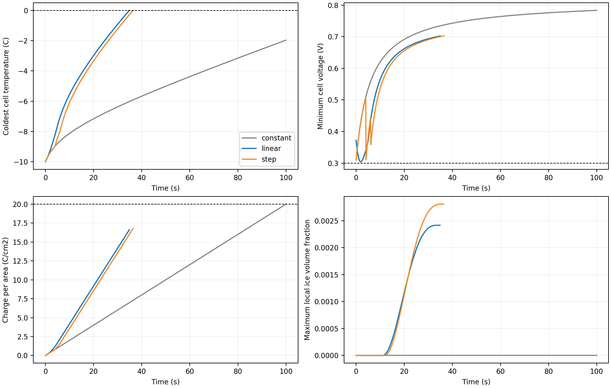

# 问题2求解结果与分析

本报告执行[问题2的解决方案](问题2的解决方案.md)：在问题1校准模型上建立五片串联、双端板热容和片间导热的电堆，按题面 20 C·cm⁻² 电荷量、0.5 A·cm⁻² 电流密度及单片全过程不低于 0.30 V 的要求计算。数值来自[可复算程序](stack_model.py)、[搜索程序](run.py)、[最终复核程序](finalize.py)和[完整结果](results/table3.json)。它们是**模型预测**；问题1实验仅覆盖 −20/−25 ℃ 的 36.6 s 窗口，没有直接验证本问的融冰和成功时刻。

## 1. 三类策略的表3结果

| 加载策略 | 搜索所得加载参数 | 启动时间/s | 累计电荷量/C·cm⁻² | 最大电流密度/A·cm⁻² | 最低单片电压/V | 最大局部冰体积分数 | 结果 |
| --- | --- | ---: | ---: | ---: | ---: | ---: | --- |
| 恒流 | $j=0.200$ | — | 20.000 | 0.200 | 0.3093 | 0.00000 | 未启动；电荷达到上限时最冷片 -1.965 ℃ |
| 线性升载 | $j_0=0.170$，$j_1=0.500$，$t_r=5.00$ s | 34.90 | 16.625 | 0.500 | 0.3044 | 0.00242 | 成功 |
| 三段阶梯 | $j_1=0.2000$，$j_2=0.3800$，$j_3=0.5000$；$\tau_1=4.00$ s，$\tau_2=6.00$ s | 36.45 | 16.785 | 0.500 | 0.3004 | 0.00281 | 成功 |

表中恒流行的电荷量是**未启动时的上限消耗**，并非启动消耗。恒流对 $0.020$–$0.220$ A·cm⁻² 以 0.005 间隔扫描；扫描中末时最接近 0 ℃ 的恒流为 0.200 A·cm⁻²，仍未启动。线性和阶梯参数由有界随机搜索、局部细化及临界区网格搜索取得；因此表中“最优”是**已搜索范围内的最佳可行候选**，尚无全局最优性证明。阶梯策略的 4 s、6 s 两次切换均发生在启动前，三段都实际执行。其最低电压仅比安全线高 0.0004 V，对参数扰动敏感。

## 2. 最低初始温度与失败单片

以 $T_{\rm amb}=T_0$、各部件同温起始、线性策略参数固定为表3的最优候选，在 84 网格/片、0.0125 s 最大步长下，**-11.28 ℃ 可启动**，而 **-11.29 ℃ 未启动**；后者在电荷耗尽时最冷片仍为 **-0.0064 ℃**。因此，对该固定策略，最低可启动温度被数值夹在 -11.29 ℃ 与 -11.28 ℃ 之间，搜索间距 0.01 ℃。临界温度的判定对时间步敏感：0.05 s 步长下 −11.28 ℃ 未启动，减至 0.0125 s 后变为可启动。因此更稳妥地将结果写作**约 −11.3 ℃（模型预测）**，不要把 0.01 ℃ 当成物理精度。这不是所有可能电流曲线的数学最优下界；当前没有足够的实验验证可将其解释为真实电堆的最低温度。[逐温度结果](results/temperature_boundary.csv)给出完整检查点。

低于边界时，第 **1、5** 片是最后升至 0 ℃ 的两片；五片镜像对称，故两端同时构成热学瓶颈。失效记录中第1/5片约 -0.006 ℃，第3片约 5.880 ℃，两块端板约 -6.038 ℃。端板吸收反应热并向外散热，首尾电池的浓差极化系数又降低它们的电压，形成端部热量与电压的双重劣势。该失效案例首先触发的是**电荷耗尽而端片未达温度目标**；最低电压 0.3004 V，尚未跌破 0.30 V。

## 3. 守恒、阈值与可信度

三个表3工况的最大水量闭合误差为 3.23e-16 kg·m⁻²、最大全堆能量闭合误差为 4.27e-07 J。线性和阶梯方案均满足 $q\le20$、$j\le0.5$、全过程 $V_k\ge0.30$ V。题目指定的冰阈值 0.99 是**控制体总体积中的冰体积分数**；本模型各多孔层初始孔隙率至多 0.8，且冰受孔容限制，所以这一阈值在本模型中不可能先于孔容约束触发，不能用“冰未达 0.99”证明冰过程已获验证。更有判别力的是电压、温度与孔隙冰饱和度。

作为数值与物理不确定性，需留意问题1的冻结动力学/液水迁移未被局部冰量实验标定，−10 ℃ 初温不在问题1的两组试验工况内，最低温度搜索还涉及更长时段。[敏感性结果](results/sensitivity.json)分别改变了冻结速率、液水迁移、端部浓差系数和热阻。冻结速率改变五倍时最大冰体积分数明显变化；片间及端板等效热阻减半时，固定线性策略在 −10 ℃ 反而未能启动，热阻加倍时约 26 s 启动。这说明端板连接的未知热阻对结果影响远大于表中启动时间的百分位差。若采用另一种端板热容或端部极化闭合，需重算表3与温度边界。

## 4. 复算口径

输入采用[问题1当前参数](../result/metrics.json)，面积 25 cm²，片间导热按五层 MEA 加 4 mm 双极板的串联热阻，端板独立热容均为 98.75 J·K⁻¹。利用首尾镜像对称性，以三组完整的一维单片状态代表五片，并用七节点网络计算两端板和五片的热交换。五片串联的电荷预算只积分一次电流密度；电压阈值在每个内部积分步及切换点检查。运行 `D:/Anaconda/python.exe 问题2/finalize.py` 可重新生成本报告引用的表、轨迹和图片；`D:/Anaconda/python.exe 问题2/run.py` 可重新执行候选参数搜索。表3使用每片 84 格和 0.05 s 最大步长，最低温度边界使用 0.0125 s 最大步长。
