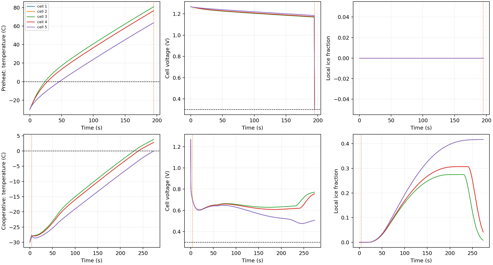
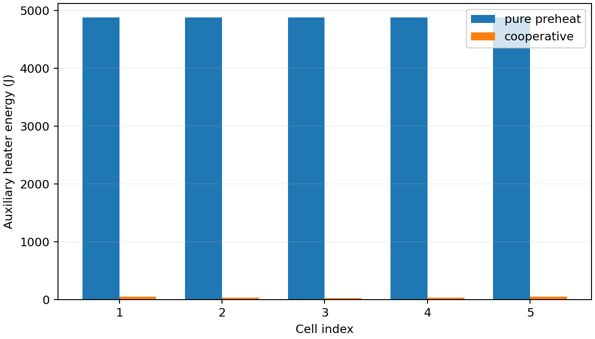
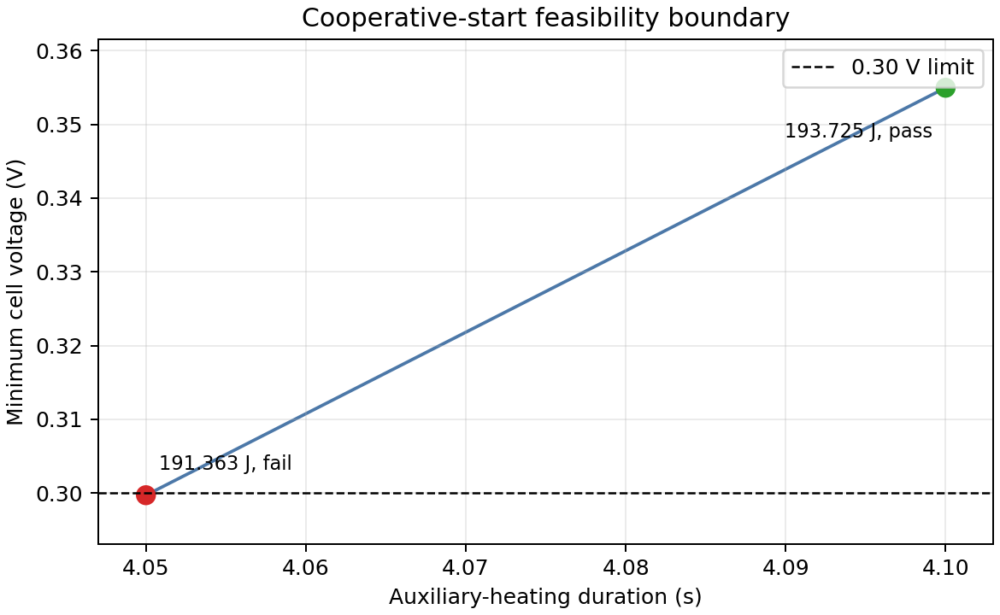

# 问题3解决过程与结果分析

## 1. 题意修正后的主结论

本次重新读取赛题 PDF 第5—6页后，按原文重构了两种辅助冷启动方式。

- **纯预加热启动**：先在 $j=0$ 时加热，五片温度均超过 0 ℃后立即开始加载电流。由于题面给出的 0→0.3 A·cm⁻²、60 s 坡升明确排除纯预热，本方案在预热后衔接问题2中已经优化出的 0.17→0.50 A·cm⁻²、5 s 线性加载策略，并在加载右极限检查电压。不再使用“瞬时加载 0.3 A·cm⁻²”的附加假设。
- **恒定功率协同启动**：从 $t=0$ 同时施加电热丝功率和题定电流曲线，电流在60 s内由0升至0.3 A·cm⁻²，此后保持0.3 A·cm⁻²。

表4采用 84 个厚度网格/片、五片独立状态和最大时间步0.05 s复算。数值均为现有模型预测，不是实测值，也不表示已经取得解析全局最优证书。

| 辅助冷启动策略 | 加热功率密度分配 $(q_1,q_2,q_3,q_4,q_5)$/W·cm⁻² | 加热持续时间/s | 各片辅助加热能耗/J | 总辅助加热能耗/J | 总启动时间/s | 最大冰体积分数 | 启动结果 |
| --- | --- | ---: | --- | ---: | ---: | ---: | --- |
| 纯预加热启动 | (1.00, 1.00, 1.00, 1.00, 1.00) | 46.50 | (1162.50, 1162.50, 1162.50, 1162.50, 1162.50) | 5812.50 | 46.50 | 0 | 成功 |
| 恒定功率协同启动 | (0.50, 0.32, 0.25, 0.32, 0.50) | 4.10 | (51.25, 32.80, 25.625, 32.80, 51.25) | 193.725 | 272.80 | 0.41725 | 成功 |

协同候选的细时间步结果为271.625 s，112格复核为276.40 s。因此总启动时间应理解为约272—276 s，而不是具有0.01 s物理精度的确定值。

## 2. 纯预加热的优化与复算

### 2.1 连续热网络搜索

预热阶段电流为零，没有反应产水、结冰和电化学产热。七节点无载热网络可写为

$$
\mathbf C\dot{\boldsymbol T}
=-\mathbf K(\boldsymbol T-T_{\rm amb})+\boldsymbol P_{\rm aux}.
$$

在 $0\le q_k\le1$ W·cm⁻²、五片温度均不低于0.01 ℃、加载初始电流0.17 A·cm⁻²时五片电压均不低于0.3005 V的数值裕度下，多起点SLSQP均收敛到五片满功率。连续模型候选为

$$
t_h=46.4419\ \mathrm s,qquad E_{\rm aux}=5805.24\ \mathrm J.
$$

这说明在当前端板散热和功率上限下，降低任一片功率会延长共同加热时间，并增加向冷端板的累计散热，不能降低总能耗。为了保证严格越过0 ℃，最终复算将加热时长上取为46.50 s。

### 2.2 开始加载时的状态

加热46.50 s后，五片平均温度为

$$
(0.0354,\ 11.5124,\ 15.2847,\ 11.5124,\ 0.0354)\ ^\circ\mathrm C,
$$

两块端板仍约为 −15.4625 ℃。首尾片受冷端板吸热，是最晚越过0 ℃的单片；中间片明显过热，是五片共享同一加热时长和单片功率上限所造成的结果。

在 $t_h^+$ 接入问题2线性加载策略的初始电流0.17 A·cm⁻²后，五片电压为

$$
(0.40017,\ 0.43094,\ 0.44070,\ 0.43094,\ 0.40017)\ \mathrm V,
$$

最低电压0.40017 V，高于0.30 V；预热期无反应产水，最大冰体积分数为0。因此该方案完成了“温度过零后开始加载电流”的原文要求，而不是把温度过零状态单独当作未加载的结果。

### 2.3 加载后5 s跟踪检查

继续沿0.17→0.50 A·cm⁻²曲线计算5 s，最低电压为0.32832 V，仍满足电压下限；但冷端板继续吸热，使首尾片最低降至 −1.2785 ℃，5 s末约为 −1.1890 ℃。这一结果不改变问题2“首次同时达标”的启动定义，却表明46.50 s方案几乎没有温度裕度。

因此应区分两层结论：

1. 按原题首次达标口径，46.50 s、5812.50 J的纯预热方案成功；
2. 若工程上要求加载后持续保持五片温度高于0 ℃，应增加预热温度裕度，或在问题4中采用加载后的动态辅助加热控制。该附加稳定性要求不应悄悄写进问题3主表。

## 3. 恒定功率协同启动的优化与复算

### 3.1 搜索过程

协同启动严格使用题定电流：

$$
j(t)=\min(0.005t,0.3)\ \mathrm{A\,cm^{-2}}.
$$

先搜索均匀加热和端部增强方案，再在左右对称功率

$$
(q_e,q_m,q_c,q_m,q_e)
$$

下细化功率和持续时间。首尾片同时受到冷端板吸热和10倍浓差极化位置系数影响，因此最优候选向两端片分配更多辅助热量；但过度削弱中间片也会改变局部水冰状态并导致电压失效，不能简单把全部功率集中在两端。

当前搜索选择

$$
\boldsymbol q=(0.50,0.32,0.25,0.32,0.50)\ \mathrm{W\,cm^{-2}},
\qquad t_h=4.10\ \mathrm s.
$$

其各片能耗为

$$
(E_1,E_2,E_3,E_4,E_5)
=(51.25,32.80,25.625,32.80,51.25)\ \mathrm J,
$$

总能耗为193.725 J。

### 3.2 启动轨迹与瓶颈

五片独立状态主复算在272.80 s首次满足温度条件。此时五片温度为

$$
(0.00249,\ 2.83331,\ 3.77404,\ 2.83331,\ 0.00249)\ ^\circ\mathrm C,
$$

两端板约为 −4.4152 ℃。首尾片仍是决定总启动时间的温度瓶颈。

全过程最低单片电压为0.44119 V，启动时首尾片电压约0.50034 V；最大局部冰体积分数为0.41725，出现在首尾片。五片在启动时的最大局部冰体积分数约为

$$
(0.41725,\ 0.04197,\ 0.00857,\ 0.04197,\ 0.41725).
$$

可见端部增强加热降低了端片热学劣势，但没有消除端部冰积累。全过程最大孔隙占用率约0.99767，说明该方案仍接近局部传质恶化边界，电压约束必须逐时间步检查。

累计电荷量约为72.84 C·cm⁻²。它未作为问题3约束，但用于说明协同方案依赖长时间反应产热；辅助电热丝能耗很小不等于系统总能耗一定更小。

## 4. 两种策略比较

### 4.1 辅助加热能耗

协同方案比纯预热少用

$$
5812.50-193.725=5618.775\ \mathrm J,
$$

辅助电热丝能耗降低约96.67%。其原因是协同方案只用4.10 s辅助加热跨过早期电压和结冰风险，之后主要由电化学反应热升温；纯预热在无电流、无反应热条件下必须同时加热五片和冷端板系统。

### 4.2 启动速度

纯预热约46.50 s开始加载并满足首次达标条件；协同方案约272.80 s才使最冷端片越过0 ℃。协同方案节省辅助电能，但比纯预热慢约226.30 s，体现了明显的能耗—时间权衡。

### 4.3 端部冰堵抑制

纯预热在加载前没有反应产水，因此启动时最大冰体积分数为0，对端部冰堵的预防最直接。协同方案在长时间升载中持续产水，首尾片最大冰体积分数约0.417，远高于中间片。两端片分配0.50 W·cm⁻²、中心片0.25 W·cm⁻²是针对该风险的端部增强，但其抑冰效果仍弱于纯预热。

图1　纯预热行包含开始加载后的5 s跟踪；竖线表示辅助加热停止。协同启动行持续到首次成功时刻。

图2　纯预热五片均满功率；协同策略把更多辅助能量分配给首尾片。

## 5. 数值验证

| 复核工况 | 启动结果 | 启动时间/s | 最低电压/V | 最大冰体积分数 | 最大孔隙占用率 |
| --- | --- | ---: | ---: | ---: | ---: |
| 4.10 s，84格/片，最大步长0.025 s | 成功 | 271.625 | 0.35496 | 0.41739 | 0.99801 |
| 4.10 s，112格/片，最大步长0.05 s | 成功 | 276.400 | 0.53163 | 0.41050 | 0.98108 |
| 4.05 s，84格/片，最大步长0.025 s | 失败：电压越限 | — | 0.29970 | 0.41572 | 0.99806 |

4.05 s和4.10 s对应的辅助能耗分别为191.3625 J和193.725 J。前者在细时间步下跌破0.30 V，后者在两组离散复核中均成功。因此当前搜索把稳健可行边界定位在两者之间，并选193.725 J作为表4结果。

图3　4.05 s候选低于电压安全线，4.10 s候选通过细时间步复核。

主复算的最大单片水质量闭合误差为 $4.19\times10^{-15}$ kg·m⁻²，全堆能量闭合误差绝对值约 $9.64\times10^{-7}$ J；纯预热能量闭合误差绝对值约 $2.12\times10^{-7}$ J。

## 6. 结论边界

1. 问题1数据只覆盖 −20/−25 ℃、约36.6 s，问题3的 −30 ℃和约273 s协同启动属于明显外推。
2. 协同候选的孔隙占用率接近1，最低电压对网格和时间步较敏感；193.725 J应表述为“当前搜索与离散复核下的最小可行候选”，不能宣称解析全局最优。
3. 纯预热后的电流曲线是依据问题2最优结果作出的必要闭合。若赛题组织方给出另一条专用加载曲线，应按该曲线重新计算加载右极限电压和后续稳定性。
4. 表4比较的是辅助电热丝能耗。协同方案还消耗约72.84 C·cm⁻²电荷，未折算燃料能耗和输出电能，故不能据此直接判定全系统能耗最低。

## 7. 复算文件

- [表4 CSV](results/table4.csv)
- [完整结果 JSON](results/table4.json)
- [离散验证结果](results/verification.json)
- [纯预热优化记录](results/preheat_search.json)
- [纯预热轨迹](results/preheat_trajectory.csv)
- [协同轨迹](results/cooperative_trajectory.csv)
- [运行清单](results/run_manifest.json)
